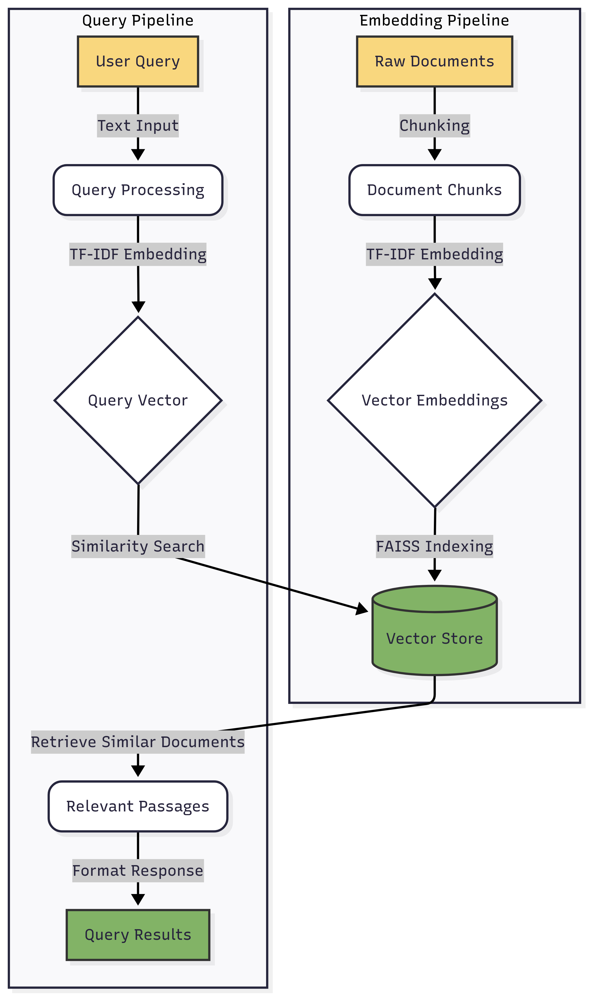

<div align="center">

# RAG FAQ Assistant

╭──────────────────────────────────────────────────────────────╮
│                                                              │
│   ██████╗  █████╗  ██████╗      ███████╗ █████╗  ██████╗     │
│   ██╔══██╗██╔══██╗██╔════╝      ██╔════╝██╔══██╗██╔═══██╗    │
│   ██████╔╝███████║██║  ███╗     █████╗  ███████║██║   ██║    │
│   ██╔══██╗██╔══██║██║   ██║     ██╔══╝  ██╔══██║██║▄▄ ██║    │
│   ██║  ██║██║  ██║╚██████╔╝     ██║     ██║  ██║╚██████╔╝    │
│   ╚═╝  ╚═╝╚═╝  ╚═╝ ╚═════╝      ╚═╝     ╚═╝  ╚═╝ ╚══▀▀═╝     │
│                                                              │
│    ┌─┐┌─┐┌─┐┬┌─┐┌┬┐┌─┐┌┐┌┌┬┐                                │
│    ├─┤└─┐└─┐│└─┐ │ ├─┤│││ │                                 │
│    ┴ ┴└─┘└─┘┴└─┘ ┴ ┴ ┴┘└┘ ┴                                 │
│                                                              │
╰──────────────────────────────────────────────────────────────╯

<p align="center">A local RAG system for document Q&A without API dependencies</p>

[](https://opensource.org/licenses/MIT)
[](https://www.python.org/downloads/)
[](https://github.com/srikanthrupireddyai/rag-faq-assistant/issues)
[](https://github.com/psf/black)
[](https://github.com/srikanthrupireddyai/rag-faq-assistant/actions)
[](https://github.com/srikanthrupireddyai/rag-faq-assistant/blob/main/Dockerfile)
[](https://makeapullrequest.com)

[Features](#features) • [Getting Started](#getting-started) • [System Architecture](#system-architecture) • [Usage](#usage) • [Web UI](#web-ui) • [Roadmap](#future-development-roadmap) • [FAQ](#faq)

</div>

## Legal Disclaimer

⚠️ **Important**: This project is **not affiliated with, endorsed by, or in any way officially connected to Amazon Web Services (AWS)**.

This is an independent, educational project that provides a tool for processing and retrieving information from AWS Well-Architected Framework documentation. Users should always refer to the [official AWS documentation](https://docs.aws.amazon.com/wellarchitected/latest/framework/welcome.html) for authoritative and up-to-date information.

The AWS Well-Architected Framework documentation is copyrighted by Amazon Web Services, Inc. This project does not redistribute any AWS documentation. Users are responsible for downloading the official documentation themselves and for complying with AWS's terms of use.

A retrieval-augmented generation (RAG) system that allows users to query AWS Well-Architected Framework documentation using natural language. This implementation uses TF-IDF embeddings and FAISS for efficient similarity search without requiring external API keys.

## Features

- 📚 Query AWS Well-Architected Framework documentation with natural language
- 🔍 TF-IDF vectorization for document embedding without external API dependencies
- 🚀 FAISS vector store for efficient similarity search
- 💻 Works completely locally with no API quota limitations
- 🧩 Modular design that can be extended with other embedding models or LLMs

## System Requirements

- Python 3.8 or higher
- Required Python packages listed in `requirements.txt`
- Sufficient memory to load document embeddings and the FAISS index

## Installation

1. Clone this repository:
   ```bash
   git clone https://github.com/srikanthrupireddyai/aws-well-architected-faq-assistant.git
   cd aws-well-architected-faq-assistant
   ```

2. Create and activate a virtual environment (recommended):
   ```bash
   python -m venv venv
   source venv/bin/activate  # On Windows: venv\Scripts\activate
   ```

3. Install dependencies:
   ```bash
   pip install -r requirements.txt
   ```

## Setup

1. Create a `.env` file in the project root and add your OpenAI API key (optional - needed only if you want to use LLM-based answers):
   ```
   OPENAI_API_KEY=your_openai_api_key_here
   ```

2. **Download AWS Documentation**:
   - Visit the [AWS Well-Architected Framework documentation](https://docs.aws.amazon.com/wellarchitected/latest/framework/welcome.html)
   - Download the official documentation in your preferred format
   - Create a directory called `raw_docs/` in the project root
   - Place the downloaded documentation files in this directory
   - **Note**: This repository does NOT include any AWS documentation files

3. Run the embedding creation script to process your documents and create the vector store:
   ```bash
   python create_embeddings.py
   ```

## Usage

### Interactive Mode

To start an interactive session with the FAQ assistant:

```bash
python query_assistant.py
```

This will launch the interactive console where you can ask questions about the AWS Well-Architected Framework.

### Single Query Mode

To ask a single question programmatically:

```bash
python query_assistant.py "What is the AWS Well-Architected Framework?"
```

### Integration Mode

You can also import the assistant in your Python code:

```python
from query_assistant import answer_question

result = answer_question("What are the pillars of AWS Well-Architected Framework?")
print(result["answer"])
print("Sources:", result["sources"])
```

## System Architecture



*Architecture diagram showing document processing and query pipelines*

## How It Works

1. **Document Processing**: The system reads AWS Well-Architected Framework documents and splits them into manageable chunks.

2. **Embedding Creation**: Instead of using external embedding APIs, the system uses TF-IDF (Term Frequency-Inverse Document Frequency) vectorization to create document embeddings locally. This approach:
   - Works entirely offline ✅
   - Avoids API rate limits and costs 💰
   - Eliminates dependency on external services 🔌

3. **Vector Storage**: Embeddings are stored in a FAISS (Facebook AI Similarity Search) index, which enables efficient similarity search.

4. **Query Processing**: When a user asks a question:
   - The query is converted to a TF-IDF vector 🔄
   - FAISS finds the most similar document chunks 🔎
   - The system returns the most relevant passages along with their source documents 📑

### Key Components

| Component | Technology | Purpose |
|-----------|------------|--------|
| Vectorizer | TF-IDF (scikit-learn) | Creates numerical representations of text |
| Vector Store | FAISS | Efficiently indexes and searches embeddings |
| Chunking | Custom | Breaks documents into meaningful segments |
| Similarity Search | Cosine Similarity | Measures document relevance to queries |

5. **LLM Integration** (Optional): If an OpenAI API key is provided, the system can use GPT models to generate concise answers based on the retrieved passages.

## Project Structure

```
.
├── README.md               # This file
├── requirements.txt        # Python dependencies
├── .env                    # Environment variables (OpenAI API key)
├── create_embeddings.py    # Script to process documents and create embeddings
├── query_assistant.py      # Interactive query interface
├── raw_docs/               # Directory where YOU must place downloaded documents (not included)
└── faiss_index/            # Directory where the vector store is saved
```

## Extending the System

### Using Different Embedding Models

The current implementation uses TF-IDF for simplicity and avoiding dependencies, but you can modify the `create_embeddings.py` script to use other embedding models:

- HuggingFace sentence-transformers (requires additional dependencies)
- OpenAI embeddings (requires API key)
- Other local embedding models

### Adding LLM-based Responses

While the current implementation is retrieval-only, you can enhance it with LLM-powered answers by modifying the `query_assistant.py` file to use models like:

- OpenAI's GPT models
- Local LLMs (like Llama, Mistral, etc.)
- Other API-based language models

## Web UI

The repository includes a simple web interface for interacting with the FAQ assistant. To use it:

```bash
# Install the web dependencies
pip install -r requirements.txt

# Start the web server
python web_app.py
```

Then open your browser to http://localhost:8000 to use the web interface.

### Docker Deployment

You can also run the application using Docker:

```bash
# Build and run using docker-compose
docker-compose up --build
```

## FAQ

### How is this different from other RAG systems?

This implementation focuses on being entirely local and dependency-light. By using TF-IDF vectorization instead of API-based embeddings, it avoids rate limits, costs, and accessibility issues common with other RAG implementations.

### Can I use this with other documentation?

Yes! While this example is configured for AWS Well-Architected Framework documentation, the system can work with any text documentation. Simply place your text files in the `raw_docs/` directory and run `create_embeddings.py`.

### What kinds of queries work best?

The TF-IDF approach works best with keyword-heavy, factual queries. It may not perform as well with highly conceptual or abstract questions compared to neural embedding models.

### How can I improve performance?

- Split documents into smaller, more focused chunks
- Adjust the number of results returned with the `k` parameter
- Consider alternative embedding models for specific use cases
- Clean and normalize your documentation before processing

### Can I use this in production?

While this system is functional, it's primarily designed as an educational example. For production use, consider:
- Adding authentication and access controls
- Implementing proper error handling and monitoring
- Setting up backups for your vector store
- Ensuring your documentation usage complies with all legal requirements

## License

[MIT License](LICENSE)

This license applies **only** to the code in this repository and not to any AWS documentation or content that may be processed by this code. AWS documentation is subject to AWS's own terms and copyright.

## Citation

When using this project, please cite the original AWS Well-Architected Framework documentation:

```
Amazon Web Services, "AWS Well-Architected Framework", AWS Documentation
https://docs.aws.amazon.com/wellarchitected/latest/framework/welcome.html
```

## Contributing

Contributions are welcome! Please feel free to submit a Pull Request.
## Future Development Roadmap

### Making the System Generic

- **Configurable Document Sources**: Create a configuration system for specifying document URLs and sources
- **Modular Architecture**: Refactor code into distinct modules for scraping, processing, embedding, and querying
- **Multiple Document Types**: Add support for PDFs, Markdown, HTML, and other formats

### User Interface Enhancements

- **Rich UI Components**: Add charts and visualizations for answer exploration
- **Real-Time Query Suggestions**: Implement typeahead and query refinement features
- **Mobile App**: Develop native mobile applications for iOS and Android
- **Browser Extension**: Create browser extensions for quick access to documentation

### CI/CD Pipeline Enhancements

- **Expanded Test Coverage**: Increase unit and integration test coverage
- **Automated Release Management**: Set up semantic versioning and automatic changelog generation
- **Deployment Automation**: Configure automatic deployments to hosting platforms
- **Infrastructure as Code**: Use Terraform or AWS CDK to define cloud resources
- **Container Registry Integration**: Publish Docker images to GitHub Container Registry or Docker Hub

### Remote Vector Database Integration

- **Managed Services**: Integrate with Pinecone, Weaviate, Qdrant, or Milvus
- **Self-hosted Options**: Deploy FAISS on cloud services or use PostgreSQL with pgvector
- **Hybrid Approach**: Implement caching and incremental updates for better performance

### LLM Integration

- **Multiple LLM Support**: Add integration with various LLMs (OpenAI, Anthropic, Llama, Mistral, etc.)
- **Self-Hosted Models**: Support for running local models via Ollama or llama.cpp
- **Model Comparison**: Allow users to compare responses from different LLMs
- **Chain of Thought**: Implement more sophisticated RAG patterns using structured outputs
- **Custom Model Fine-tuning**: Enable fine-tuning on domain-specific knowledge

### Additional Features

- **Authentication**: Add user accounts and API keys for secure access
- **Usage Analytics**: Track query patterns and performance metrics
- **Custom Training**: Allow users to add their own documents for customized knowledge bases

We welcome contributions to any of these areas! Feel free to open issues or pull requests to help move these initiatives forward.
