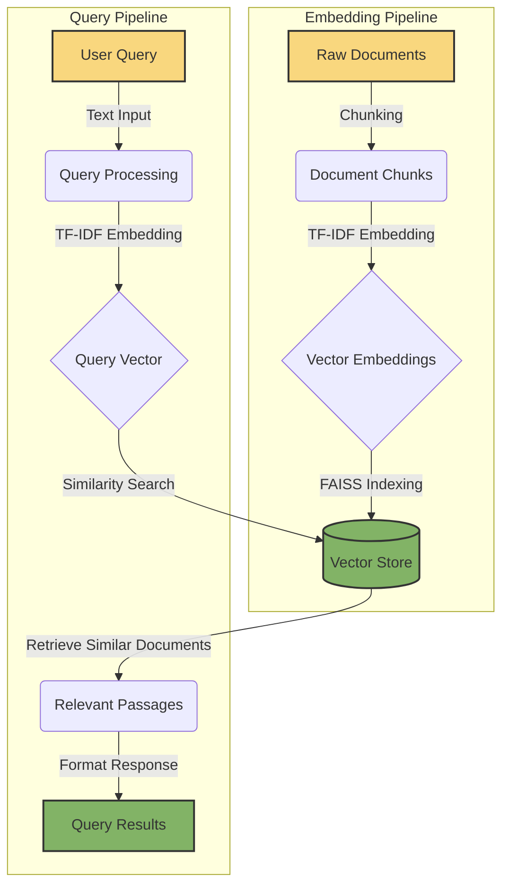

```mermaid
graph TD
    A[Raw Documents] -->|Chunking| B(Document Chunks)
    B -->|TF-IDF Embedding| C{Vector Embeddings}
    C -->|FAISS Indexing| D[(Vector Store)]
    
    E[User Query] -->|Text Input| F(Query Processing)
    F -->|TF-IDF Embedding| G{Query Vector}
    G -->|Similarity Search| D
    D -->|Retrieve Similar Documents| H(Relevant Passages)
    H -->|Format Response| I[Query Results]
    
    subgraph "Embedding Pipeline"
    A
    B
    C
    D
    end
    
    subgraph "Query Pipeline"
    E
    F
    G
    H
    I
    end

    style A fill:#f9d77e,stroke:#333,stroke-width:2px
    style D fill:#82b366,stroke:#333,stroke-width:2px
    style E fill:#f9d77e,stroke:#333,stroke-width:2px
    style I fill:#82b366,stroke:#333,stroke-width:2px
```

This is a Mermaid diagram - you'll need to convert this to an image or use a GitHub-compatible rendering approach.
